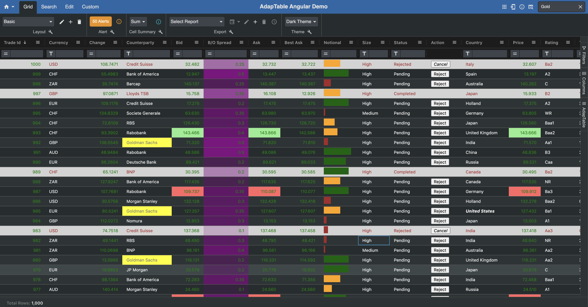

# AdapTable Angular Example App

This example app shows a demo instance of AdapTable using the [Angular Wrapper](https://docs.adaptabletools.com/docs/angular-wrapper/angular-wrapper-overview).



### Versions and Dependencies
The demo is built using these key packages:

- [Angular](https://github.com/angular/angular) version 10
  - variants of this demo app are available, built with [Angular v11](https://github.com/AdaptableTools/example-adaptable-angular-aggrid/tree/angular-11) and [Angular v12](https://github.com/AdaptableTools/example-adaptable-angular-aggrid/tree/angular-12)
- [Adaptable](https://docs.adaptabletools.com/) version 11
- [AG Grid](https://www.ag-grid.com) version 26.2.0

> 10 is the minimium Angular version required for using Adaptable.

### Dummy Ticking Data
The data displayed in the demo is dummy, meaningless data.  

The demo is designed to display the features available in AdapTable rather than be a live system.
It displays 1000 fictitious 'Trades' that contain a combination of string, numeric, date and boolean columns.

Each 'Trade' has a Status ('Pending', 'Completed' or 'Rejected') allowing us to demo the editing and conditional styling capabilities of AdapTable.

Every 20 miliseconds one of these Trades will randomly 'tick' - whereby 6 columns in the row will change values.


## Predefined Config
AdapTable allows developers to provide [Predefined Config](https://docs.adaptabletools.com/docs/key-topics/predefined-config) in their application. 

These are the objects (e.g. Searches, Layouts, Reports, Conditional Styles) that end-users will be able to access from Day 1 (and depending on their [Entitlements](https://docs.adaptabletools.com/docs/advanced-features/entitlements), they can add, edit or delete them).

This demo contains a huge amount of Predefined Config to illustrate many of the features availabe in AdapTable.  It includes:

### Layout
In this demo we have created 4 [Layouts](https://docs.adaptabletools.com/docs/advanced-features/layout-module)
- *Basic* - shows column visibility and order including Calculated Columns and Action Columns (see below)
    
    > Note: This Layout includes 3 Calculated Columns and a FreeText Column

- *Sorted* - shows column sorts including Custom Sorts (see below)
  
  > Note: This Layout includes a Sparkline Column

- *Row Grouped* - shows 2 Grouped Row Columns

- *Pivot* - shows AdapTable in pivot view with aggregations and pivoted columns

### Conditional Style
There are 4 [Conditional Styles](https://docs.adaptabletools.com/docs/styling/conditional-style-module) provided:
- Row Style of gray background with brown forecolor where Status is 'Rejected'
- All numeric columns are green forecolor where value is positive
- All numeric columns are red forecolor where value is negative
- 'Country' column shows font bold and italics where value is 'United States'

### Format Column
There are 5 [Format Columns](https://docs.adaptabletools.com/docs/styling/format-column-module) provided.

3 use Number or Date Formatters:
- **Date columns** - will use Format: ‘dd/MM/yyyy’
- **Number Ccolumns** - will align to right
- **Ask, Bid, Price, BestAsk** columns - will have 3 decimal places

2 use Numeric Styles
- Notional Column has a [Percent Bar](https://docs.adaptabletools.com/docs/styling/format-column-module#percent-bar) with 3 Ranges
 
  - Less than 2.5M is red
  - Between 2.5 and 5M is orange
  - Greater than 5M is green

- The 'Bid Offer Spread' column has a [Gradient Style](https://docs.adaptabletools.com/docs/styling/format-column-module#gradient) (in a rather vulgar purple)

### Query
There is one [Named Query](https://docs.adaptabletools.com/docs/searching/query-module#named-queries) called 'Pending Dollar Trades'.

Its [Expression](https://docs.adaptabletools.com/docs/adaptableql/expression) is: "
```[status] = 'Pending' AND [tradeDate] > NOW() AND [currency] IN ('EUR', 'USD')"```
 
### Export
The demo contains one Custom Report - 'Trades Due this Week' - which has:
- Bespoke column list
- Uses an Expression to get the rows:
  ```"[status] = 'Pending' AND  [tradeDate] > NOW() AND DIFF_DAYS([tradeDate], NOW()) <7"```

> Note: we have scheduled this report to run each day at 17:30

### Custom Sort
There is one [Custom Sort](https://docs.adaptabletools.com/docs/advanced-features/custom-sort-module) on the 'Currency' column.

It sorts by USD, GBP, EUR and then the rest of the column values alphabetically.
 
### Theme
The demo has been set up to use the [dark theme](https://docs.adaptabletools.com/docs/theming/using-themes) - though this can be changed in the Theme Daashboard Toolbar or the ToolPanel.

### Alert
The demo includes 3 [Alerts](https://docs.adaptabletools.com/docs/notifications/alerts-module):

- **Standard Alert** (which will get triggered by the ticking data).  This Alert has the following characteristics:

  - Is of type 'Warning' - so that it shows in Amber
  - Is triggred if the Notional column value equals 10,000,000 (a [Predicate](https://docs.adaptabletools.com/docs/adaptableql/predicate))
  - Also requires the Currency column to have the value of 'USD' (an [Expression](https://docs.adaptabletools.com/docs/adaptableql/expression))

- **Flashing Alert** - The 'Bid', 'Ask', 'Price' Columns all have [Flashing Alerts](https://docs.adaptabletools.com/docs/notifications/flashing-alerts) applied (using bespoke colours).

- **Validation Alert** - The 'Bid Offer Spread' and 'Notional' columns have a [Validation Alert](https://docs.adaptabletools.com/docs/notifications/alerts-module#validation-alerts) which constrains new values to be positive.

  > Note: If running in OpenFin or Glue42 this will work also when exporting to Excel and editing there


### Calculated Column
3 [Calculated Columns](https://docs.adaptabletools.com/docs/advanced-features/calculated-column-module) have been provided:

- ‘Best Ask’ - displays the min of 4 columns - ask, BloombergAsk, MarkitAsk and IndicativeAsk
- ‘Diff Days’ - shows the diff in days between Trade Date and Settlement Date
- ’Size’ - returns a string based on the size of the Notional Column (using conditional logic)

    >Note: as data ticks in the Grid, the notional Percent Bar updates and so does this calculated column
 
### FreeText Column
There is one [FreeTextColumn](https://docs.adaptabletools.com/docs/advanced-features/freetext-column-module) called 'Comments'.

This has 2 comments pre-populated (rows 983, 996).

 
### Sparkline Column
One [Sparkline Column](https://www.ag-grid.com/angular-data-grid/sparklines-overview/) has been created for the  'History' column - viewable in the 'Sorted' Layout

### Action Column
An [Action Column](https://docs.adaptabletools.com/docs/advanced-features/action-column) called 'Action' has been provided with these rules:
- It does not display if Status is 'Completed'
- The button displays differently whether Status is 'Pending' or 'Rejected'
- When clicked it changes the Status of the Trade (based on current Status)


### Shortcut
One [Shortcut](https://docs.adaptabletools.com/docs/editing/shortcut-module) has been created on Numeric columns.

It will multiply the existing cell value by 1,000,000 when the 'M' is clicked

> Try it by typing 5M into a Notional column cell


### EditLookUpItem
One [Edit Lookup Item](https://docs.adaptabletools.com/docs/user-interface/user-interface-options#edit-look-up-items) has been created for Status column to enable quick and safe editing.
 
### Quick Search
The Quick Search style has been changed to display hightlighted cells as gray text on dark yellow background.

We have also set up the search text to search for 'Gold' at start-up

## User Interface

The demo makes use of some User Interface capabilities provided by AdapTable:
### Dashboard
The AdapTable [Dashboard](https://docs.adaptabletools.com/docs/user-interface/dashboard) has been configured as follows:

- Visible Buttons - Calculated Columns, Layout and Grid Info

- 4 Tabs each with different Toolbars: 
  - **Grid** - with Toolbars: 'Layout', 'Alert', 'CellSummary', 'Export', 'Theme'
  - **Search** - with Toolbars: 'Query'
  - **Edit** - with Toolbars: 'SmartEdit', 'BulkUpdate'
  - **Custom** - with 4 Custom Toolbars: 'Trades', 'LayoutToggle', 'SlideToggle', 'LayoutMenu'

- 4 Custom Toolbars (both appear in 'Custom' Tab): 
    - **Trades** has a Toolbar Button - ‘Add Trade’ - which when clicked will add a trade to the dataset (done via the AdapTable api).

    - **LayoutToggle** is an Angular component which wraps an Angular Material ButtonToggle component and toggles between the different Layouts defined in AdaptableState. The entire implementation (and interaction with the AdaptableApi) is encapsulated&isolated in the component
    
    - **SlideToggle** is a custom Angular component which interacts with another CustomToolbar ('LayoutMenu'), enabling/disabling it

    - **LayoutMenu** is an Angular component which wraps and Angular Material Menu; the component implementation is generic and all the I/O params are provided dynamically

- More detailed information regarding Angular Custom Toolbars are provided in the [Angular Wrapper Documentation](https://docs.adaptabletools.com/docs/angular-wrapper/angular-wrapper-custom-toolbars)

### Tool Panel
The demo has been configured to include the [AdapTable Tool Panel](https://docs.adaptabletools.com/docs/user-interface/tool-panel) available at the right hand side of the Grid

### Context Menu
A custom [Context Menu](https://docs.adaptabletools.com/docs/user-interface/context-menuu) item created called ‘Reject Trade’ has been created.  It uses 2 functions:

- a predicate to decide if it should be shown - here only if Status column value is 'Pending'
- JavaScript function to be invoked when item is clicked - will change the Status to 'Rejected' 
## Custom Predicates
In addition to the many [Predicates](https://docs.adaptabletools.com/docs/adaptableql/predicate) that AdapTable ships, developers are able to provide their own [Custom Predicates](https://docs.adaptabletools.com/docs/adaptableql/predicate#custom-predicates).

This demo contains 3:

- **High** - appears in TradeId column and filters where Notional > 8000000
- **Benelux** - appears in Country column and filters where value is Holland, Belgium or Luxembourg
- **Post Takeover** - appears in any Date Column and filters where value is after a fictitious takeover date of 21/09/2021

## Audit
AdapTable has a very powerful [State Changed Event](https://docs.adaptabletools.com/docs/advanced-features/adaptable-state-changed-event).  Developers can configure what in AdapTable will be audited where it will be streamed (there are a number of different available estinations).

For ease of convenience, this demo Audit Log has been configured to send Cell Edits and User State Changes audit messaes to the Console so they can be easily viewed.

## Server-Side Functionality
Everything in this demo takes place enitrely on the client in order to reduce the complexity.

However it is possible to run AdapTable in Server Mode where all the Queries and Filters can be built by end-users in the UI but evaluated on the Server.  See the [Server Functionality Guide](https://docs.adaptabletools.com/docs/key-topics/server-functionality) for more details.

## Installation

NOTE: In order to be able to run `npm install`, you need to be logged into our private NPM registry - follow the instructions in the [Adaptable Angular Wrapper Documentation](https://docs.adaptabletools.com/docs/angular-wrapper/angular-wrapper-installation)

> If you do not have an Adpatable Login please contact support@adaptabletools.com

Run `npm install` (or `yarn`), depending on what tool you're using.

## Development Server

Run `ng serve` for a dev server. Navigate to `http://localhost:4200/`. The app will automatically reload if you change any of the source files.

## Code Scaffolding

Run `ng generate component component-name` to generate a new component. You can also use `ng generate directive|pipe|service|class|guard|interface|enum|module`.

## Build

Run `ng build` to build the project. The build artifacts will be stored in the `dist/` directory. Use the `--prod` flag for a production build.

## Running Tests

Run `ng test` to execute the unit tests via [Karma](https://karma-runner.github.io).

Run `ng e2e` to execute the end-to-end tests via [Protractor](http://www.protractortest.org/).

## Licences
A licence for AdapTable provides access to all product features as well as quarterly updates and enhancements through the lifetime of the licence, comprehensive support, and access to all 3rd party libraries.

We can make a trial licence available for a short period of time to allow you to try out AdapTable for yourself.

Please contact [`sales@adaptabletools.com`](mailto:sales@adaptabletools.com) or read the [Licence Documentation](https://docs.adaptabletools.com/docs/getting-started/licence) for more information.
 
## Demo

To see AdapTable in action visit our [Demo Site](https://demo.adaptabletools.com).  Here you can see a large number of AdapTable demos each showing a different feature, function or option in AdapTable (using dummy data sets).

## Help

Developers can learn how to access AdapTable programmatically at [AdapTable Documentation](https://docs.adaptabletools.com).

For help on the Angular CLI use `ng help` or consult the [Angular CLI README](https://github.com/angular/angular-cli/blob/master/README.md).

## More Information

General information about Adaptable Tools is available at our [Website](http://www.adaptabletools.com) 
 
## Support

For all support enquiries please email [`support@adaptabletools.com`](mailto:support@adaptabletools.com) or [raise a Support Ticket](https://adaptabletools.zendesk.com/hc/en-us/requests/new).
